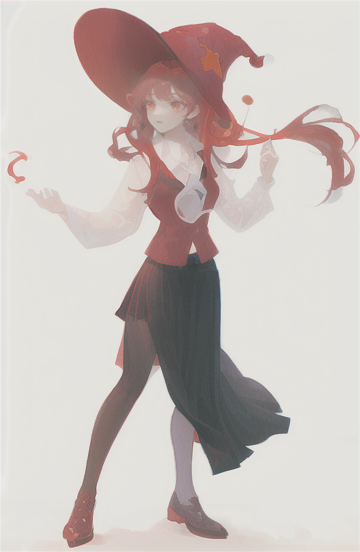

# IMG2IMG

<!-- Image -->

> positive prompt
* masterpiece, high_quality, super_detail, CG_game_cg,  a woman in a red hat and black skirt, casting spell

> negative prompt
* painting by bad-artist-anime:0.9, painting by bad-artist:0.9, watermark, text, error, blurry, jpeg artifacts, cropped, worst quality, low quality, normal quality, jpeg artifacts, signature, watermark, username, artist name, worst quality, low quality:1.4, bad anatomy, watermark, signature, text, logo